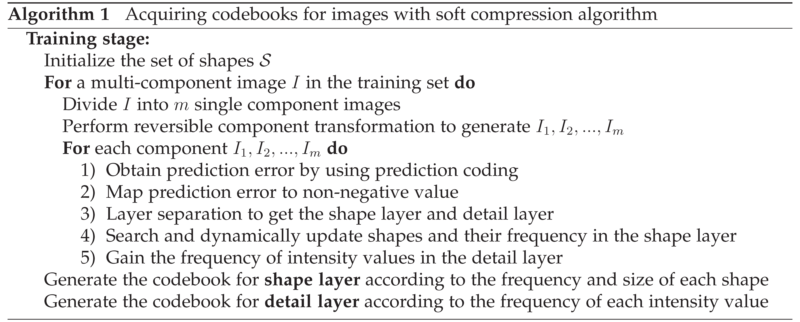
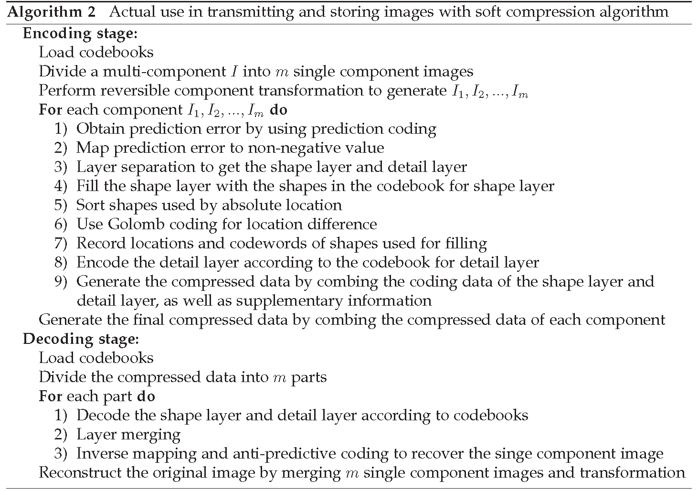

# A Lossless Compression Method for Multi-component Medical Images

### Abstract

In disease diagnosis, medical image plays an important part. Its lossless compression is pretty critical, which directly
 determines the requirement of local storage space and communication bandwidth of remote medical systems, so as to help 
 the diagnosis and treatment of patients. There are two extraordinary properties related to medical images: lossless and 
 similarity. How to take advantage of these two properties to reduce the information needed to represent an image is the 
 key point of compression. In this paper, we employ the big data mining to set up the image codebook. That is, to find 
 the basic components of images. We propose a soft compression algorithm for multi-component medical images, which can 
 exactly reflect the fundamental structure of images. A general representation framework for image compression is also 
 put forward and the measurement of compression results indicates that our developed soft compression algorithm can 
 outperform the popular benchmarks in terms of compression ratio.

### Role
- This code is designed for <font color='red'> multi-component image compression</font>, which is in lossless mode. 
- The code can get the compression ratio results on Malaria, BCCD and Melanoma datasets.
- For other datasets, just do a few changes can achive the compression effect.

## Prerequisites for Code

Required packages:
```
pip install opencv-python --user
pip install opencv-contrib-python --user
pip install numpy
```

Datasets:

```
BCCD: https://github.com/Shenggan/BCCD_Dataset
Malaria: https://bbbc.broadinstitute.org/BBBC041
Malanoma: https://www.kaggle.com/shonenkov/melanoma-merged-external-data-512x512-jpeg
```
The division of datasets:
```
DRIVE: The training and testing set given by the DRIVE are regarded as our training and testing set respectively.              \\
Malaria: We take the first 200 images as the training set, and the next 100 images as the testing set.           \\
BCCD: We select the first 500 images of BCCD as the training set and 200 images as the testing set.              \\
Melanoma: We take the first 500 images as the training set, and the next 200 images as the testing set.          \\
```
##### Notes
- We tested this code with Python 3.8 and opencv 4.0.1.
- The code also works with other versions of the packages.

### Algorithm-Part I
<div align="center">
  
</div>

### Algorithm-Part II
<div align="center">
  
</div>

## Run
- To train a model yourself, you have to first prepare the data as shown in [[Prerequisites for Code]](#prerequisites-for-code)
- Then, put them into foler 'Dataset'
- Run 'PreProcess.py' to generate the training set and testing set
- After preparation, you can run 'Decode.py' to get the results by using soft compression algorithm for multi-component image


## Future Work

- Iterative soft compression algorithm makes it have better performance
- Optimize program and improve efficiency


